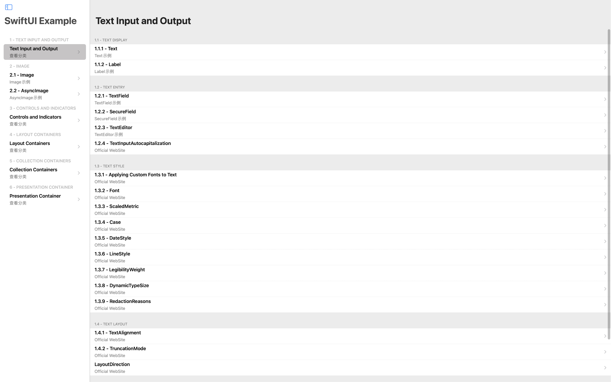
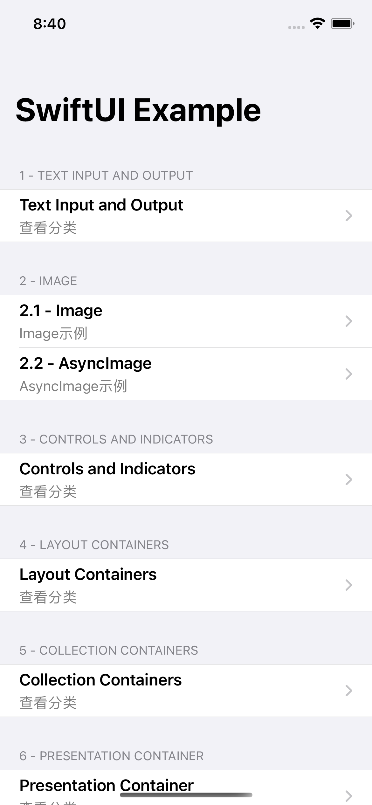

#  [SwiftUI](https://developer.apple.com/documentation/swiftui)

* 1...3 章 为 `User Interface Elements`
* 4...6 章 为 `View Containers`
* 3、4级标题带``标注为WebView展示 2级标题带``则全为WebView

## Screenshot

Mac |  iPhone
--- |  ---
 | 

## 1 - [Text Input and Output](https://developer.apple.com/documentation/swiftui/text-input-and-output)

### 1.1 - **Text Display**
### 1.1.1 - [Text](https://developer.apple.com/documentation/swiftui/text)
### 1.1.2 - [Label](https://developer.apple.com/documentation/swiftui/label)
### 1.1.3 - [`TextSelectability`](https://developer.apple.com/documentation/swiftui/textselectability)
---

### 1.2 - **Text Entry**
### 1.2.1 - [TextField](https://developer.apple.com/documentation/swiftui/textfield)
### 1.2.2 - [SecureField](https://developer.apple.com/documentation/swiftui/securefield)
### 1.2.3 - [TextEditor](https://developer.apple.com/documentation/swiftui/texteditor)
### 1.2.4 - [TextInputAutocapitalization](https://developer.apple.com/documentation/swiftui/textinputautocapitalization)
---

### 1.3 - **`Text Style`**
#### 1.3.1 - [`Applying Custom Fonts to Text`](https://developer.apple.com/documentation/swiftui/applying-custom-fonts-to-text)
#### 1.3.2 - [Font](https://developer.apple.com/documentation/swiftui/font)
#### 1.3.3 - [ScaledMetric](https://developer.apple.com/documentation/swiftui/scaledmetric)
#### 1.3.4 - [`Case`](https://developer.apple.com/documentation/swiftui/text/case)
#### 1.3.5 - [DateStyle](https://developer.apple.com/documentation/swiftui/text/datestyle)
#### 1.3.6 - [LineStyle](https://developer.apple.com/documentation/swiftui/text/linestyle)
#### 1.3.7 - [`LegibilityWeight`](https://developer.apple.com/documentation/swiftui/legibilityweight)
#### 1.3.8 - [`DynamicTypeSize`](https://developer.apple.com/documentation/swiftui/dynamictypesize)
#### 1.3.9 - [RedactionReasons](https://developer.apple.com/documentation/swiftui/redactionreasons)
---

### 1.4 - **`Text Layout`**
#### 1.4.1 - [TextAlignment](https://developer.apple.com/documentation/swiftui/textalignment)
#### 1.4.2 - [TruncationMode](https://developer.apple.com/documentation/swiftui/text/truncationmode)
#### 1.4.3 - [LayoutDirection](https://developer.apple.com/documentation/swiftui/layoutdirection)
---

### 1.5 - **`Localization`**
#### 1.5.1 - [Preparing Views for Localization](https://developer.apple.com/documentation/swiftui/preparing-views-for-localization)
#### 1.5.2 - [LocalizedStringKey](https://developer.apple.com/documentation/swiftui/localizedstringkey)
---

## 2 - [Images](https://developer.apple.com/documentation/swiftui/images)

### 2.1 - [Image](https://developer.apple.com/documentation/swiftui/image)
### 2.2 - [AsyncImage](https://developer.apple.com/documentation/swiftui/asyncimage)
---

## 3 - [Controls and Indicators](https://developer.apple.com/documentation/swiftui/controls-and-indicators)

### 3.1 - **Buttons**
#### 3.1.1 - [Button](https://developer.apple.com/documentation/swiftui/button)
#### 3.1.2 - [EditButton](https://developer.apple.com/documentation/swiftui/editbutton)
#### 3.1.3 - [PasteButton](https://developer.apple.com/documentation/swiftui/pastebutton)
#### 3.1.4 - [Link](https://developer.apple.com/documentation/swiftui/link)
#### 3.1.5 - [Menu](https://developer.apple.com/documentation/swiftui/menu)
--- 

### 3.2 - **Value Inputs**
#### 3.2.1 - [Slider](https://developer.apple.com/documentation/swiftui/slider)
#### 3.2.2 - [Stepper](https://developer.apple.com/documentation/swiftui/stepper)
#### 3.2.3 - [Toggle](https://developer.apple.com/documentation/swiftui/toggle)
---

### 3.3 - **Pickers**
#### 3.3.1 - [Picker](https://developer.apple.com/documentation/swiftui/picker)
#### 3.3.2 - [DatePicker](https://developer.apple.com/documentation/swiftui/datepicker)
#### 3.3.3 - [ColorPicker](https://developer.apple.com/documentation/swiftui/colorpicker)
---

### 3.4 - **Indicators**
#### 3.4.1 - [ProgressView](https://developer.apple.com/documentation/swiftui/progressview)
<!--watchOS 7.0+-->
#### 3.4.2 - [Gauge](https://developer.apple.com/documentation/swiftui/gauge)
---

### 3.5 - **`Configuration`**
#### 3.5.1 - [ControlActiveState](https://developer.apple.com/documentation/swiftui/controlactivestate)
#### 3.5.2 - [ControlSize](https://developer.apple.com/documentation/swiftui/controlsize)
#### 3.5.3 - [Prominence](https://developer.apple.com/documentation/swiftui/prominence)
#### 3.5.4 - [Visibility](https://developer.apple.com/documentation/swiftui/visibility)
---

## 4 - [Layout Containers](https://developer.apple.com/documentation/swiftui/layout-containers)

### 4.1 - **Essentials**
#### 4.1.1 - [`Picking Container Views for Your Content`](https://developer.apple.com/documentation/swiftui/picking-container-views-for-your-content)
#### 4.1.2 - [`Inspecting View Layout`](https://developer.apple.com/documentation/swiftui/inspecting-view-layout)
---

### 4.2 - **Stacks**
#### 4.2.1 - [HStack](https://developer.apple.com/documentation/swiftui/hstack)
#### 4.2.2 - [VStack](https://developer.apple.com/documentation/swiftui/vstack)
#### 4.2.3 - [ZStack](https://developer.apple.com/documentation/swiftui/zstack)
---

### 4.3 - **Lazy Stacks**
#### 4.3.1 - [LazyHStack](https://developer.apple.com/documentation/swiftui/lazyhstack)
#### 4.3.2 - [LazyVStack](https://developer.apple.com/documentation/swiftui/lazyvstack)
#### 4.3.3 - [`PinnedScrollableViews`](https://developer.apple.com/documentation/swiftui/pinnedscrollableviews)
---

### 4.4 - **Grids**
#### 4.4.1 - [LazyHGrid](https://developer.apple.com/documentation/swiftui/lazyhgrid)
#### 4.4.2 - [LazyVGrid](https://developer.apple.com/documentation/swiftui/lazyvgrid)
#### 4.4.3 - [GridItem](https://developer.apple.com/documentation/swiftui/griditem)
---

### 4.5 **Separators**
#### 4.5.1 - [Spacer](https://developer.apple.com/documentation/swiftui/spacer)
#### 4.5.2 - [Divider](https://developer.apple.com/documentation/swiftui/divider)
---

### 4.6 **`Alignment`**
#### 4.6.1 - [Aligning Views Within a Stack](https://developer.apple.com/documentation/swiftui/aligning-views-within-a-stack)
#### 4.6.2 - [Aligning Views Across Stacks](https://developer.apple.com/documentation/swiftui/aligning-views-across-stacks)
#### 4.6.3 - [Alignment](https://developer.apple.com/documentation/swiftui/alignment)
#### 4.6.4 - [HorizontalAlignment](https://developer.apple.com/documentation/swiftui/horizontalalignment)
#### 4.6.5 - [VerticalAlignment](https://developer.apple.com/documentation/swiftui/verticalalignment)
#### 4.6.6 - [AlignmentID](https://developer.apple.com/documentation/swiftui/alignmentid)
#### 4.6.7 - [ViewDimensions](https://developer.apple.com/documentation/swiftui/viewdimensions)
---

### 4.7 **`Edges and Regions`**
#### 4.7.1 - [Edge](https://developer.apple.com/documentation/swiftui/edge)
#### 4.7.2 - [HorizontalEdge](https://developer.apple.com/documentation/swiftui/horizontaledge)
#### 4.7.3 - [VerticalEdge](https://developer.apple.com/documentation/swiftui/verticaledge)
#### 4.7.4 - [EdgeInsets](https://developer.apple.com/documentation/swiftui/edgeinsets)
#### 4.7.5 - [SafeAreaRegions](https://developer.apple.com/documentation/swiftui/safearearegions)
#### 4.7.6 - [Anchor](https://developer.apple.com/documentation/swiftui/anchor)
---

## 5 - [Collection Containers](https://developer.apple.com/documentation/swiftui/collection-containers)

### 5.1 - **Lists**
#### 5.1.1 - [List](https://developer.apple.com/documentation/swiftui/list)
#### 5.1.2 - [ListItemTint](https://developer.apple.com/documentation/swiftui/listitemtint)
#### 5.1.3 - [Section](https://developer.apple.com/documentation/swiftui/section)
#### 5.1.4 - [ForEach](https://developer.apple.com/documentation/swiftui/foreach)
---

### 5.2 - **Tables**
#### 5.2.1 - [`Tables`](https://developer.apple.com/documentation/swiftui/tables)
---

### 5.3 - **Forms**
#### 5.3.1 - [Form](https://developer.apple.com/documentation/swiftui/form)
---

### 5.4 - **Groups**
#### 5.4.1 - [Group](https://developer.apple.com/documentation/swiftui/group)
#### 5.4.2 - [GroupBox](https://developer.apple.com/documentation/swiftui/groupbox)
#### 5.4.3 - [ControlGroup](https://developer.apple.com/documentation/swiftui/controlgroup)
---

### 5.5 - **Scroll Views**
#### 5.5.1 - [ScrollView](https://developer.apple.com/documentation/swiftui/scrollview)
#### 5.5.2 - [ScrollViewReader](https://developer.apple.com/documentation/swiftui/scrollviewreader)
#### 5.5.3 - [ScrollViewProxy](https://developer.apple.com/documentation/swiftui/scrollviewproxy)
---

## 6 - [Presentation Container](https://developer.apple.com/documentation/swiftui/presentation-containers)

### 6.1 - **Navigation**
#### 6.1.1 - [NavigationView](https://developer.apple.com/documentation/swiftui/navigationview)
#### 6.1.2 - [NavigationLink](https://developer.apple.com/documentation/swiftui/navigationlink)
#### 6.1.3 - [NavigationBarItem](https://developer.apple.com/documentation/swiftui/navigationbaritem)
---

### 6.2 - **Outlines**
#### 6.2.1 - [OutlineGroup](https://developer.apple.com/documentation/swiftui/outlinegroup)
#### 6.2.2 - [DisclosureGroup](https://developer.apple.com/documentation/swiftui/disclosuregroup)
---

### 6.3 - **Tab Views**
#### 6.3.1 - [TabView](https://developer.apple.com/documentation/swiftui/tabview)
---

### 6.4 - **Split Views**
#### 6.4.1 - [HSplitView](https://developer.apple.com/documentation/swiftui/hsplitview)
#### 6.4.2 - [VSplitView](https://developer.apple.com/documentation/swiftui/vsplitview)
---

### 6.5 - **Toolbars**
#### 6.5.1 - [ToolbarItem](https://developer.apple.com/documentation/swiftui/toolbaritem)
#### 6.5.2 - [ToolbarItemGroup](https://developer.apple.com/documentation/swiftui/toolbaritemgroup)
#### 6.5.3 - [ToolbarItemPlacement](https://developer.apple.com/documentation/swiftui/toolbaritemplacement)
#### 6.5.4 - [`ToolbarContent`](https://developer.apple.com/documentation/swiftui/toolbarcontent)
#### 6.5.5 - [`CustomizableToolbarContent`](https://developer.apple.com/documentation/swiftui/customizabletoolbarcontent)
#### 6.5.6 - [`ToolbarContentBuilder`](https://developer.apple.com/documentation/swiftui/toolbarcontentbuilder)
---

<!--### 7 - [Drawing and Graphics](https://developer.apple.com/documentation/swiftui/drawing-and-graphics)-->
